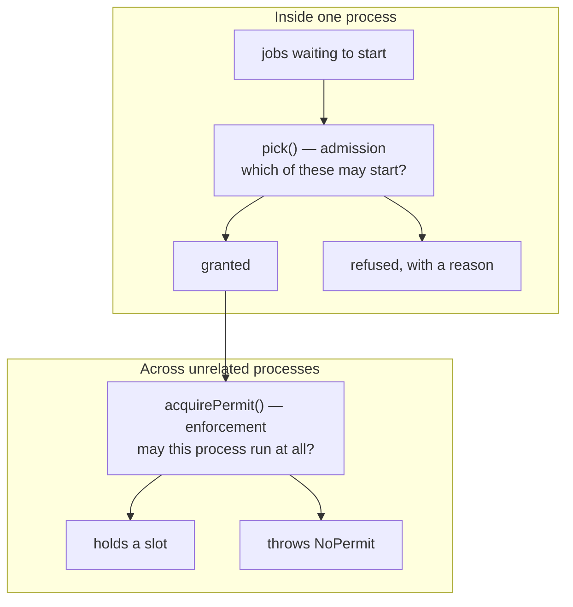

# How Marshal works

This explains the model. [README](README.md) is the landing page,
[API.md](API.md) is the reference, and [INTEGRATING.md](INTEGRATING.md) is how
to wire it into your own project.

## The problem

You are running more than one worker — agents, jobs, processes — and some of
what they touch must not be touched twice at once.

That is not a throughput problem. It is a **contention** problem, and it looks
like this. Take a team of agents doing outbound sales for one client:

- Two agents each decide the prospect is due a follow-up. The client gets two
  emails ninety seconds apart. Worse than the duplicate: one offers a discount
  and the other says pricing is firm.
- Both read the CRM opportunity, both write it. Last writer wins and the
  other's notes are gone.
- Both take the top-ranked lead, because neither claimed it, while the
  second-ranked lead gets nobody.
- Both research the same account, and the daily send cap is gone by noon —
  which stops the **whole team**, including the agent that had something
  valuable to send.

The shape is always the same: several actors, scarce things, and no single
place that decides who may proceed. Marshal is that place.

## What it is not

**Not a lock library.** A mutex gives you one lock. Marshal decides across many
jobs and many *different kinds* of scarce thing at once, all-or-nothing — this
job needs the workspace *and* provider budget *and* the deploy lock, or it does
not start.

**Not a job queue.** BullMQ, Temporal and Inngest distribute work and offer
per-queue concurrency and rate limits. Marshal refuses instead of queueing.
Most systems want both: the queue moves work around, Marshal decides what may
start.

**Not a rate limiter.** A rate limiter throttles one endpoint. Marshal answers
"may this job start, given everything it needs at once."

**You probably do not need it if** you run one worker; or you contend over
exactly one resource and waiting is fine, where a semaphore or a queue is
simpler; or your problem is throughput rather than arbitration. This is a small
package for a specific shape.

## The decision everything else follows from: never queue

A refusal names who holds the thing and returns immediately. Marshal never
blocks, never waits, never puts you in line.

This is deliberate, and it is the design's central bet: **an actor that is
refused can do something else.** Queueing is right when jobs are
interchangeable and waiting is free. When actors are autonomous and the work is
heterogeneous, waiting is usually wrong:

| Refused on | Waiting would mean | The right move |
|---|---|---|
| a work item | idling while another job is free | take the next item |
| a conversation | sending a late duplicate | drop it — someone else has it |
| provider budget | queueing behind an empty tank | stop, and tell a human |
| approval capacity | a queue nobody drains | decide, or batch the question |

A queue does the wrong thing in three of those four. This is exactly why a
refusal names its **kind**: the right response differs per kind, and an actor
can only choose if it is told which.

What it costs you: refusals are now yours to handle, and starvation becomes
your problem rather than the package's. Both are covered below.

## Two layers, and why they must not merge

Both answer "who may go," which is why merging them is the mistake worth naming
first. They answer different questions.

**`pick()` — admission.** Decides *across* the jobs you hand it, all at once,
in priority order. Pure: no clock, no filesystem, no logging. Capacity is an
argument, so nothing is stored in the package. Its output is a **decision
record**, not an enforcement.

**`acquirePermit()` — enforcement.** Wins a named slot against other OS
processes that never called `pick()` and may not even know it exists. Backed by
lease files and pid liveness — **never a TTL**, because a job legitimately runs
far longer than any timeout anyone would dare set, so a TTL either strands the
resource after a crash or steals it from work still in progress.

The distinction that matters in practice: `pick()` cannot stop code that
ignores it. If everything that touches a resource goes through your scheduler,
`pick()` is enough. If unrelated processes — a cron job, a developer's shell, a
second deployment — can touch it too, you need the permit.

## The resource model

Four kinds, and they belong to two families that behave differently. The
families are not decoration; they decide how you must treat each one.

**Reusable resources** have a fixed population. You take one and later **give it
back**. If you forget, it leaks and nothing recovers it.

**Consumable resources** are spent, not borrowed. Nothing gives them back; time
replenishes them. They still strand — a job that is charged and then crashes
leaves that charge standing until the window resets — but the stranding is
bounded by the window and heals itself, where a leaked reusable resource is
stranded forever. The subtler risk is that if your estimate of what a job costs
is wrong, the allowance quietly lies to you.

| Kind | Family | Question it answers | Refusal |
|---|---|---|---|
| `exclusive` | reusable | is this one taken? | `resource-held`, naming the holder |
| `counting` | reusable | are all N in use? | `no-capacity`, naming the holders |
| `budget` | consumable | is there allowance left in **every** window? | `budget-exhausted`, with `resets` |
| `unavailable` | neither — a gate | may it be taken yet? | `not-ready`, with an optional `until` |

`unavailable` is not a resource at all. It is a switch you flip: a circuit
breaker, a maintenance window, a provider you have decided to stop using for
ten minutes. Marshal keeps it separate because "unavailable" and "held" are
different facts, and telling an operator the wrong one sends them looking for a
holder that does not exist.

The two families explain two functions that otherwise look redundant:
`release()` returns a reusable resource, and
[`reconcile()`](API.md#reconcilewindows-input-reconciliation) settles a
consumable one against what it actually cost. They are not alternatives. If you
use both families, you need both.

They also fail differently, which is worth knowing before you pick which to
model something as. A leaked reusable resource strands **one** thing forever,
loudly — work stops and someone notices. A stranded consumable charge heals at
the next window, but a *mis-estimated* one over-grants **everything**, silently,
until the provider starts refusing you and it looks like an outage rather than
the admission error it is. That is why `reconcile()` exists and why nothing
equivalent exists for the reusable side.

## What a refusal means

Every refusal is a tagged union you can switch on exhaustively.

| Kind | What happened | Typically |
|---|---|---|
| `resource-held` | one specific holder has it | try different work; the reason names who |
| `no-capacity` | every slot is full | retry later, or add capacity |
| `not-ready` | it exists but is gated | wait for `until`, if given |
| `budget-exhausted` | an allowance window is spent | stop; `resets` says when |
| `custom` | yours — Marshal never emits it | your vocabulary, your meaning |

`custom` exists so you can express a refusal Marshal has no business
understanding, and the package is tested never to construct one itself.

## What is guaranteed

**Marshal cannot deadlock.** Deadlock requires four conditions at once; the
design removes two of them permanently.

- *Hold-and-wait* is gone because `pick()` is all-or-nothing. A job takes
  everything it declared or nothing at all — it can never sit on two resources
  while wanting a third.
- *Circular wait* is gone because nothing ever waits. A refused job holds
  nothing, so there is no chain to close.

If databases are your background: this is **conservative two-phase locking** —
predeclare the whole claim set, acquire it atomically, never block partway. Same
guarantee, same price: deadlock freedom in exchange for declaring your needs up
front and accepting lower concurrency.

## What is *not* guaranteed

Read this part. Three of these have bitten real systems.

**Starvation is yours.** Removing deadlock leaves starvation: a low-ranked job
can be refused forever, and nothing in the package notices. The classical fix is
*aging* — let waiting raise effective priority — and Marshal deliberately ships
no ranking function, because an aging curve is policy. If your `rank` ignores
how long a job has waited, you have built a scheduler that can starve.
[INTEGRATING.md](INTEGRATING.md#writing-a-rank-function) has a working one.

**The deadlock guarantee is per `pick()` call.** If your code takes a permit and
*then* calls `pick()`, it is holding one thing while waiting for another — you
have reintroduced hold-and-wait yourself, outside where the guarantee applies.

**A grant is a decision, not an enforcement.** `pick()` returns what *should*
happen. It does not hold anything, and nothing stops code that ignores the
answer. Applying the decision is your job, and it is the step most often missed
— see [You own the state](INTEGRATING.md#you-own-the-state).

**It is not a transaction or a snapshot.** Between deciding and acting, the
world can change. If one job reads a record while another rewrites it,
admission control does not help — that is a versioning problem, and Marshal
does not address it.

**`acquirePermit()` is one machine only.** Its mutual exclusion rests on
`openSync(file, "wx")`, which is atomic on a local filesystem and not reliably
atomic over NFS, and on pid liveness, which has no meaning across machines — a
lease written by another host is read either as held by an unrelated local pid
or as abandoned. Putting the lease directory on a shared volume looks like it
works and is not safe. `pick()` has no such limit: it is pure, so it decides
identically anywhere you run it.

## What Marshal refuses to know

- **No dependencies.** Nothing outside `node:` — the build fails otherwise.
- **No vocabulary from your domain.** Six nouns are banned from exported names
  and checked on every build, because the first draft of the refusal type had
  three of them.
- **No clock and no filesystem in `pick()`.** You pass `now`.
- **No memory.** Capacity is an argument; the state lives in your storage.

That last one is the trade at the heart of the package, and it cuts both ways.
It means Marshal cannot read your state behind your back, cannot drift from
your model, and can be read end to end in an afternoon. It also means **nothing
happens unless you make it happen** — which is the first thing
[INTEGRATING.md](INTEGRATING.md) covers.
