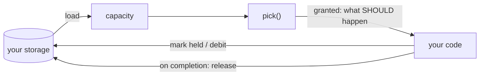

# Putting Marshal in your project

[ARCHITECTURE.md](ARCHITECTURE.md) explains the model and is worth reading
first. This page is the wiring: where the call goes, what you must store, and
what changes as you grow from one process to many.

## The loop

Everything is one cycle. You run it whenever you have work that might start —
on a timer, on a queue event, whenever a job finishes.

```ts
import { pick } from "@ludentes/marshal/pick"

// 1. Load the current state. Yours, from wherever you keep it.
const capacity = await loadCapacity()

// 2. Decide. This is pure — it changes nothing.
const { granted, refused } = pick({
  jobs: await pendingJobs(),
  capacity,
  rank,
  now: Date.now(),
  cost,
})

// 3. Apply the decision. Marshal did not.
for (const g of granted) {
  await markHeld(g.holds, g.job)
  void run(g.job).finally(() => releaseHeld(g.holds, g.job))
}

// 4. Record refusals so a human can see why nothing moved.
for (const r of refused) await noteRefusal(r.job, r.blocked)
```

## You own the state

Step 3 is the one people skip, so it gets its own heading.

**`pick()` copies the capacity you hand it, decides against the copy, and
returns.** It does not hold anything, mark anything, or remember anything. If
you do not apply the result, the next call sees the same free capacity and
grants the same resource again.



Two consequences worth internalising:

- **Reusable resources must be released by you**, on every exit path including
  crashes. A grant that is never released leaks the resource permanently.
  Marshal has no timeout that will clean it up, by design.
- **Asking is not free of consequence, but asking twice is.** `pick()` has no
  side effects, so you can safely call it to preview a decision. What is *not*
  safe is applying the result twice.

## Naming your resources

This is the decision you are most likely to get wrong, and it fails silently in
both directions. Marshal never parses your names — they are opaque strings — so
the name is the entire specification of what contends with what.

> **The rule:** two actors that must not proceed together have to compute the
> *same* string. Two that may proceed independently have to compute
> *different* ones.

Put the **scope** in the name, because scope is exactly what decides whether two
actors collide:

| Name | Scope | Why |
|---|---|---|
| `provider:anthropic` | global | the quota belongs to the API key, not the machine |
| `thread:client-8812` | global | the client is one person wherever your code runs |
| `crm:opp-441` | global | one record in one system |
| `workspace:alpha@runner-3` | one machine | a checkout on a disk; another host's copy is a different thing |
| `t42:provider:anthropic` | one tenant | per-customer allowance |

Getting this wrong is quiet. Too *coarse* — one name where you needed two — and
unrelated work blocks each other, which looks like poor throughput. Too *fine* —
two names where you needed one — and the collision you were preventing happens
anyway, which looks like a bug somewhere else entirely.

If you want the effect of locking a parent and a child together, name both and
let all-or-nothing do it: `needs: ["account:acme", "crm:opp-441"]` acquires both
or neither.

## Which layer do you need?

**`pick()` alone** is enough when everything that touches the resource goes
through your scheduler. This is the common case.

**Add `acquirePermit()`** when processes that never called `pick()` can touch
the same thing — a cron job, a deploy script, a developer's shell, a second
copy of your service started by accident. The permit stops them; a `pick()`
grant cannot, because it is only a decision record.

Take the permit **from your process entry point, not at module scope.** If your
framework evaluates the module twice in one process, the second evaluation finds
a live holder and the process refuses itself. There is deliberately no same-pid
exemption — the lease cannot tell which evaluation is the real one.

## Budgets

A budget is a **set of windows**, and admission must satisfy every one:

```ts
capacity.budget = {
  "provider:anthropic": [
    { name: "5h",   limit: 87, spent: 3,  resets: now + 4 * 3600_000 },
    { name: "week", limit: 13, spent: 13, resets: now + 3 * 86400_000 },
  ],
}
```

Both windows are real, and the tightest one is your actual allowance — the
others are burst limits. On a measured run the weekly window bound throughput
6.7× harder than the 5-hour one, so pacing to the 5-hour figure drained the week
in a day. When several windows are short, the refusal reports the **latest**
reset among them, so you are not told to retry in five hours while a weekly
allowance is gone.

**An unpriced job is free.** `pick()` takes `job.cost`, else `cost(job)`, else
**zero** — and a zero-cost job is admitted by a completely exhausted window.
Guessing a number would be a policy, so the package refuses to guess. *If you
configured a budget and never see a refusal, this is why.*

Note the current shape: `CostFn` is `(job) => number` with no resource argument,
so one job needing two differently-denominated budgets debits the same number to
both. If you budget tokens and emails in one job today, price them yourself per
resource rather than relying on a single `CostFn`.

### Reconcile, or the budget lies

Debiting only the estimate means the budget never learns the estimate was
wrong. A `CostFn` that systematically underestimates keeps granting while the
real allowance drains, and it surfaces as a provider outage rather than as the
admission error it is.

```ts
import { reconcile } from "@ludentes/marshal/pick"

const { windows, drift, beyondTolerance } = reconcile(currentWindows, {
  estimated: 500,
  actual: 1400,
  tolerance: 0.5,
})
await saveWindows(windows)
if (beyondTolerance) warn(`cost estimate off by ${Math.round(drift * 100)}%`)
```

Run it when a job finishes. `beyondTolerance` is your signal that the estimator
itself needs work — a thermostat rather than a thermometer.

## Writing a rank function

`rank` decides the order jobs are considered. Two contracts:

**It must return every job exactly once.** Not a subset, not a duplicate —
`pick()` throws otherwise. A rank that filters would lose a job into neither
`granted` nor `refused`, where nothing could ever notice it.

**The returned order is what counts, not the number.** `pick()` walks the array
as given and does not sort. The `rank` number is carried into the grant for your
audit trail. If you compute scores, you must sort by them yourself.

Marshal ships no default, because an aging curve is policy. Here is one that
prevents starvation — copy it and change the constants:

```ts
const CAP = 5           // most a job can gain from waiting
const INTERVAL = 60_000 // one point per minute waited

const rank = (jobs, now) =>
  jobs
    .map((job) => {
      const base = priorityOf(job)
      const waited = Math.min(CAP, Math.floor((now - submittedAt(job)) / INTERVAL))
      return { job, rank: base + waited, why: { base, waited } }
    })
    .sort((a, b) => b.rank - a.rank)
```

The cap matters. Without it, age eventually outranks everything and priority
stops meaning anything; with it, a waiting job climbs a bounded amount and then
holds. **If your `rank` ignores waiting time entirely, low-priority jobs can be
refused forever** — Marshal removes deadlock, not starvation.

## Growing: one process, many processes, many machines

**One process.** Keep capacity in memory. A plain `Map` is genuinely fine — this
is what the [sieve](https://github.com/Ludentes/sieve) reference does. Nothing
here needs a database.

**Many processes, one machine.** `acquirePermit()` works as designed: lease
files in a shared directory, pid liveness, no TTL. For `pick()`, capacity must
now be shared — either move it to storage both processes read, or elect a single
process that decides and have the others ask it. The second is usually simpler,
and it sidesteps the race below.

If you do share storage, note that `pick()` decides against a *copy*. Two
processes reading the same capacity can both grant the same last slot. The fix
is ordinary optimistic concurrency: read a version alongside the capacity, and
commit your changes only if the version has not moved; on conflict, re-read and
call `pick()` again. Re-running it is safe precisely because it is pure.

**Many machines.** `pick()` still works — it is pure, so it decides identically
anywhere. **`acquirePermit()` does not.** Its guarantee rests on
`openSync(file, "wx")`, atomic on a local filesystem and not reliably atomic
over NFS, and on pid liveness, which has no cross-machine meaning: a lease
written by another host is read either as held by an unrelated local pid or as
abandoned. Pointing the lease directory at a shared volume appears to work and
is not safe.

Today the honest answer for cross-machine mutual exclusion is to use something
built for it — a Redis lock, a Postgres advisory lock, your cloud's coordination
service — and keep Marshal for the admission decision above it. A store port
that would let `acquirePermit()` delegate to those is designed but not built.

## Common mistakes

- **Not applying the result.** `pick()` changes nothing. See
  [You own the state](#you-own-the-state).
- **Not releasing on the failure path.** Reusable resources leak, and nothing
  reclaims them.
- **Budgeting without a cost.** Unpriced is free, so the budget never binds.
- **A `rank` that filters or duplicates.** It throws — which is the good case;
  the silent version would lose jobs.
- **A `rank` that ignores waiting.** No deadlock, but starvation.
- **Taking the permit at module scope.** The process refuses itself.
- **Names that are too coarse or too fine.** Both fail silently.
- **Sharing a lease directory across machines.** Looks fine, is not safe.
